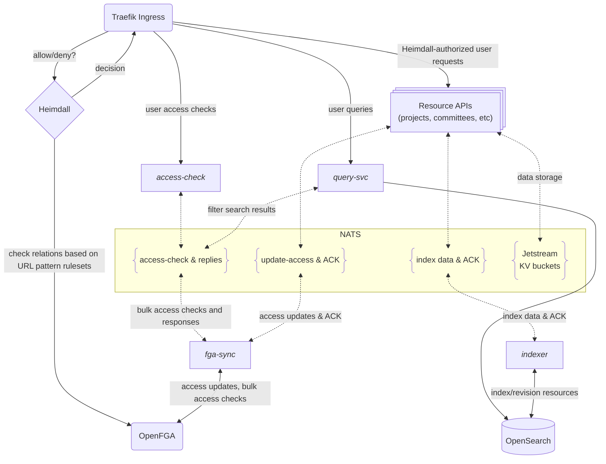

# LFX v2 Helm charts

This repository contains Helm charts for deploying the LFX v2 platform on Kubernetes.

## Repository structure

```text
lfx-v2-helm/
└── charts/
    └── lfx-platform/       # Main LFX Platform chart
        ├── templates/      # Kubernetes templates
        ├── Chart.yaml      # Chart metadata
        ├── values.yaml     # Default values
        └── README.md       # Documentation
```

## Installation

See the [lfx-platform chart README](./charts/lfx-platform/README.md) for
installation instructions.

## Components

LFX v2 includes the following infrastructure components:

- **Traefik**: API Gateway and Ingress Controller.
- **OpenFGA**: Fine-Grained Authorization with Relationship-Based Access
  Control (ReBAC).
- **Heimdall**: Access decision service, bridges Traefik to OpenFGA.
- **NATS**: Messaging layer used by LFX v2 resource APIs to communicate with
  each other and with platform components; also provides durable key-value storage.
- **OpenSearch**: Powers platform global search and audit log capabilities.

Building on those, custom platform components provide shared services essential
to the LFX v2 platform:

- **[indexer](https://github.com/linuxfoundation/lfx-v2-indexer-service)**:
  Processes messages from resource APIs to keep OpenSearch in sync
  with data changes, and propagates data events to the rest of the platform.
- **[fga-sync](https://github.com/linuxfoundation/lfx-v2-fga-sync)**: Processes
  messages from resource APIs to keep OpenFGA relationships in sync with data
  changes, and acts as a caching proxy for serving OpenFGA bulk access-check
  requests in the platform.
- **[query-svc](https://github.com/linuxfoundation/lfx-v2-query-service)**:
  HTTP service for LFX API consumers to perform
  access-controlled queries for LFX resources, including typeahead and
  full-text search.
- **[access-check](https://github.com/linuxfoundation/lfx-v2-access-check)**:
  HTTP service for LFX API consumers to perform bulk access checks for
  resources.

Key LFX resource APIs are forthcoming, which can be optionally enabled with this chart.

## Component diagram



## Configuration

See the [lfx-platform chart README](./charts/lfx-platform/README.md) for configuration options and examples.

## Releases

This repository automatically publishes Helm charts to GitHub Container Registry (GHCR) when tags are created.

### Creating a Release

1. Update the chart version in `charts/lfx-platform/Chart.yaml` as part of any
   pull requests which update the chart manifests or configuration.
2. After the pull request is merged, create a GitHub release and choose the
   option for GitHub to also tag the repository. The tag can be anything, but
   the current convention is for the format `v{version}` (e.g., `v0.0.2`). This
   tag does _not_ have to match the chart version: it is an `appVersion` that
   is unused at the umbrella chart level, and _only_ used to trigger Helm
   releases.
3. The GitHub Actions workflow will automatically:
   - Package the Helm chart
   - Publish it to `ghcr.io/linuxfoundation/lfx-v2-helm/chart`
   - Sign the chart with cosign for security
   - Generate SLSA provenance attestation

## Development

To contribute to this repository:

1. Fork the repository
2. Commit your changes to a feature branch in your fork. Ensure your commits
   are signed with the [Developer Certificate of Origin
   (DCO)](https://developercertificate.org/).
   You can use the `git commit -s` command to sign your commits.
3. Ensure the chart version in `charts/lfx-platform/Chart.yaml` has been
   updated following semantic version conventions.
4. If you are adding a new platform component, ensure it is documented in the
   [component diagram](#component-diagram) and the README.
5. Run MegaLinter locally at the root of the working directory to check for
   errors or linting problems:
   ```bash
   docker run --rm --platform linux/amd64 \
     -v "$(pwd):/tmp/lint:rw" \
     oxsecurity/megalinter-documentation:v8
   ```
6. Submit your pull request

## License

Copyright The Linux Foundation and each contributor to LFX.

This project’s source code is licensed under the MIT License. A copy of the
license is available in `LICENSE`.

This project’s documentation is licensed under the Creative Commons Attribution
4.0 International License \(CC-BY-4.0\). A copy of the license is available in
`LICENSE-docs`.
