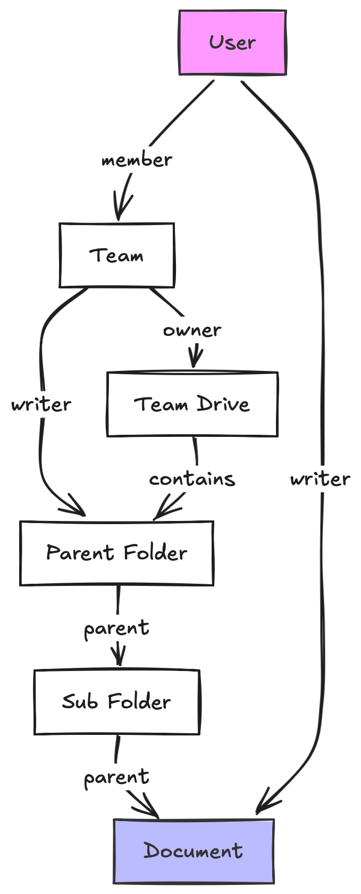

# Entity design documentation

This document provides comprehensive guidance for designing entities, API layouts, and OpenFGA types in the LFX v2 platform. It serves as developer-onboarding documentation for understanding how to model entities that integrate with OpenFGA permissions, the Query Service, and platform API design patterns.

## Introduction to OpenFGA permissions

OpenFGA (<https://openfga.dev>) is a relationship-based access control (ReBAC) system, which is a permission system where access decisions take into account a network of relationships between entities. Most systems implementing this derive from the Google Zanzibar paper. For example, in order to have "writer" access to a Google document, I might be a "writer" on the document itself, or I might be a "member" of a team that has "writer" access to folder which is a "parent" of yet another folder that is the "parent" of the document, or I might have "owner" access to a team drive containing that folder! The only check for granting write access is whether I have a "writer" relationship to the document, and this relation will evaluate as true even if it is an transitive relationship across _multiple_ hops in the relationship graph. This kind of access inheritance is also intuitive for users. Nobody has to show them a complex graph of relationships to understand why they have access to a given document: it just works the way they expect.



This is contrasting with a role-based access control (RBAC) system, like AWS IAM role policies, which store and evaluate allow/deny patterns that are always **directly evaluated** against an explicit target resource to determine access.

Likewise, in the previous "ACS" LFX RBAC system, we have project roles that inherit policies for how you can interact with a project: managing committees, scheduling meetings, managing mailing lists, etc. However, it cannot "fan out" access to these project resources on a contextual level:

- LFX with ACS: **project meeting-managers** can access all _past meeting recordings_ for **all meetings associated with the project**
- LFX with OpenFGA: you can access the _past meeting recording_ if you were **invited to the meeting**, or if you are currently a **member of the committee** that held this meeting in the past, or if you are a **project meeting-manager** on the project the meeting was held on"

With ACS, if a business requirement required additional access ("I can access the past meeting recording because I was invited"), we essentially had to bypass our defined access control rule described above with a "back door": have another app or service use super-admin access to fetch the resource, in order to re-publish it with a custom access control check implemented in that app or service's code.

OpenFGA's ability to model and evaluate granular, per-object access business requirements makes our permissions more transparent and auditable. In addition, supporting direct, context-aware access to individual objects in LFX opens the door to supporting AI use-cases like MCP servers for managing committees, meetings, and more.

### Core concepts

Understanding the following core concepts will help you navigate access control in the LFX v2 platform.

**Model**: The schema that defines the types of entities and the kinds of relations users and objects can have with each other (e.g., users can be members of teams, teams can own projects, projects have a parent project). Our model is version-controlled and stored in this repository.

**Tuple**: A relation between two _specific_ objects of any type, conforming to the model, which is stored as a fact in OpenFGA. For example: "user:alice is a member of team:frontend" or "project:platform is the parent of project:web-app". The v2 platform maintains a live sync that indexes LFX data (projects, committees, etc.) into corresponding OpenFGA tuples, in real time.

**Relationship**: A relationship is the traversal or chaining of tuples, as defined by the model, to determine if a given *transitive* relationship exists. For example, if Alice is a member of the frontend team, and the frontend team owns the web-app project, then Alice has an ownership relationship to the web-app project. Throughout this document, when we refer to a "relationship", we always an queried relationship derived from chained tuples and the model definitions, and we will use the term "tuple" when referring to a *direct* relation "fact". The v2 platform uses OpenFGA's "batch check" endpoint to query relationships.

**Permission**: It's not enough to define a model, store tuples, and be able to check relationships: we also need to define *what* relationship is required to perform a given action. For example, a GET request to `/projects/{id}` may be defined to require the relationship "user:{authenticated_user} is a viewer of project:{id}". Defining permissions as relationships is not always straightforward. For instance, to implement a user story "the project admin can create child projects", you might have `/projects/{id}/create_child` endpoint, and define a relation against the project ID extracted from the URL, just like the previous example. However, for a most RESTful API structure, you should instead define the permission that a POST request to `/projects` requires a "writer" relationship of the authenticated user against the `parent_project` attribute of the **POST payload**. In the v2 platform, permissions are defined as Kubernetes RuleSet CRD resources. Unlike the model, which is fully centralized, individual services may define their own rules, but the *enforcement* of the rules is still done centrally, by middleware in our API Gateway, to ensure a consistent, transparent access control paradigm.

### GitHub PR example

Let's walk through a complete example showing how OpenFGA models, tuples, relationships, and permissions work together for a simplified, GitHub-like pull request system.

#### Model definition

First, we define the OpenFGA model that describes relations which can be queried against any given object type, any tuples that can be created (indicated by the brackets) and how to chain these, including across types (indicated by the "from" keyword):

```plain
type organization
  relations
    define owner: [user]
    define member: [user] or owner

type team
  relations
    define member: [user] or [team:member]

type repository
  relations
    define organization: [organization]
    define writer: [user] or [team:member] or owner from organization
    # Unlike writer, we don't inherit readers from organization members, because
    # this depends on a "condition": the visibility configuration of the repo.
    # See the "conditional relations" section of this doc for more info.
    define reader: [user:*] or [user] or [team:member] or writer

type pullrequest
  relations
    define repository: [repository]
    define author: [user]
    define writer: writer from repository
    define closer: author or writer
    define reader: author or writer or reader from repository
```

Considerations:
- There is no "singleton" relation definition, for example, that a pull request only may have (or must have) exactly **one** repository relation. These kinds of data constraints are enforced by the system that creates and deletes tuples into OpenFGA, not by OpenFGA itself.
- Ordinarily, "greater" relations will explicitly cascade into "lesser" relations (owner → writer → reader), because any given permission (the allow/deny rule defined for a given URL and method) should only check a _single_ relationship. Rather than "writers or readers can GET this resource", you want "readers can GET this resource", and then you include writers as having the readers relation automatically. This also is why a relation like "closer" is defined in the model: it's just an abstraction over two other relations, so that the permission can be defined with only a single relationship to check.
- The `[team:member]` syntax means that the tuple will point to a team, but when evaluated, it's actually a reference to the "members" relation of that team. The example model not only allows configuring teams as repo readers or writers, but it also allows teams to include other teams (nested teams).

#### Permissions definition

Next, we implement rules defining what relationships are required for each API method & endpoint. (The following statements are simplifications of the actual RuleSet DSL.)

```plain
# Any repo reader can create a PR.
POST {"repo_id": {id}, ...} => /pullrequests: <reader on repository:{id}>

# Any reader on the PR can create a comment on it.
POST {"pullrequest_id": {id}, "body": ...} => /pr_comments: <reader on pullrequest:{id}>

# Any writer on the PR can merge it.
POST => /pullrequests/{id}/merge: <writer on pullrequest:{id}>

# Closing the PR uses a special "closer" relation which allows the author to
# close their own PR, even if they have no write access to the repo/PR.
POST => /pullrequests/{id}/close: <closer on pullrequest:{id}>
```

#### Sample tuples

Now we'll define some mock data. These tuples would be stored in OpenFGA by mapping or transforming the live data as it is created and updated. For simplicity, we won't use teams, even though we defined them in the model above.

```plain
# Organization data
user:alice owner organization:linux-foundation
user:bob member organization:linux-foundation
user:charlie member organization:linux-foundation

# Repository
organization:linux-foundation organization repository:lfx-platform
user:charlie reader repository:lfx-platform
user:dave reader repository:lfx-platform

# Pull Request
repository:lfx-platform repository pullrequest:456
user:charlie author pullrequest:456
```

#### Relationship resolution

From these tuples, OpenFGA would dynamically compute relationships when checked:

**For pullrequest:456:**
- `user:alice` has `writer` (owner org:linux-foundation → writer repo:lfx-platform → writer)
- `user:alice` has `closer` (writer → closer))
- `user:alice` has `reader` (writer → reader)
- `user:bob` has NO relations (org members have no implicit repo relations)
- `user:charlie` does NOT have `writer`
- `user:charlie` has `closer` (author → closer)
- `user:charlie` has `reader` (author → reader OR reader repo:lfx-platform → reader)
- `user:dave` has only `reader` (reader repo:lfx-platform → reader)

## Entity type design

Not all objects in LFX need, or should have, OpenFGA types.

### When to create OpenFGA types

**Create OpenFGA types when entities need "extra access" patterns** - that is, when permissions cannot be wholly expressed through relationships to parent resources.

#### Examples of entities requiring OpenFGA types

1. **Projects**: Each project may add authorized users for that project: child projects may have "extra" admins beyond the admins of the parent or umbrella project
2. **Committees**: Committees belong to projects, but ordinarily consist of members who have no project-level relation, but should have access to the committee and its meetings
3. **Past meetings**: Requires a "point in time" capture of the participant list from the meeting itself
4. **Vote responses**: A voter should be able to retain access to their own submission

#### Examples of entities NOT requiring OpenFGA types

1. **Past meeting artifacts**: Access can be defined wholly by user relation to the past meeting
2. **Project domains**: Access can be defined wholly by user relation to the project: _different domains on a project don't require different admins_
3. **Committee members**: Represented as the "member" relation/tuple on the committee type, not a type itself
4. **User profiles**: User **is** a "type", but it has no relations defined _against_ it. Access to other user's profiles (name, email) is primarily via the authenticated user's relation to search across objects (committees, mailing lists) which themselves hold collections of users (denormalized user profiles). Moreover, access to SSO profiles or CDP/CM profiles, when implemented, would be a global "team relation" check, not a per-object-ID relation check against individual user-type objects.

### Entity types for indexing and Query Service

Even entities that don't require OpenFGA types still need **entity type classifications** for:

- **Indexing**: Organizing data in OpenSearch with proper type mappings
- **Query Service**: Enabling type-specific search and filtering
- **API Design**: Consistent endpoint structure and foreign-key naming conventions

Because of the importance of these platform-wide services, type names for these other objects **must be unique** within the platform, even though they do not show up in the OpenFGA model.

See the "Best practices" section for naming conventions for these non-OpenFGA types.

## Conditional relations

We refer to a relation as "conditional" when whether or not a relation will be present must depend on the state of the object. For example, to return to our GitHub PR example from above: a repository might have a "visibility" setting that can be "public", "private", or "internal".

If the repository is public, then we can store this as a tuple `user:* has reader on repo:456`—provided the special `[user:*]` relation is allowed, as it was in the model above.

If the repository is "private", then we'd expect that all access grants would be directly defined against this repo, like "charlie" and "dave" were, or how we'd expect teams to have been authorized, if we had included tuples for those.

But what about supporting an "internal" visibility, where we automatically want to grant viewer access to _any_ organization members, like `bob`? **There are 3 ways we could do this:**

### Conditional propagation of tuples

This solution keeps the same model we saw originally:

```plain
type repository
  relations
    # ...
    define reader: [user:*] or [user] or [team:member] or writer
```

The code responsible for syncing data into OpenFGA, that is, creating and deleting tuples when repos are created or updated, could evaluate the visibility setting of the repository, and if it is "internal", then it could fetch all members of the organization, and create "viewer" relation tuples against the repository for _each of these users_, granting them access to the repository. There are several downsides to this approach:

- **Lots** of extra tuples to store in OpenFGA. If the organization has 1000 members, each new internal repository adds 1000 more tuples that OpenFGA must process.
- We need a way to propagate data changes from a single object which affect the tuples for _multiple_ objects. A change to the organization to add a member would need to either now be responsible for also updating the tuples for every internal repository, or, the code responsible for mapping repository data to repository tuples needs to monitor organization changes.
- Needing to propagate _direct_ relations across multiple objects is antithetical to why one uses a relational access control system in the first place.

### OpenFGA native conditions

OpenFGA provides a solution for this out of the box, [Conditions](https://openfga.dev/docs/modeling/conditions). The model would look like this:

```plain
type repository
  relations
    define organization: [organization]
    # ...
    define reader: [user:*] or [user] or [team:member] or writer ↩
      or [organization:member with is_internal_visibility]

  condition is_internal_visibility(visibility: string) {
    visibility == "internal"
  }
```

In this case, two tuples are *always* created for the organization: one for the "organization" relation, and another for the "reader" relation: though the latter doesn't evaluate to the organization itself, but rather to its members (see "team" explanations above). However, any time the "reader" relation on some repository is being checked for a given user, the client making the API call to OpenFGA *must* pass the actual value of "visibility" for *that repository* as "context" in the check request. This adds complexity and latency, because our Heimdall authorization pipelines would actually need to fetch objects over the REST API _first_, in order to have the current data values, to provide the necessary inputs to the OpenFGA access check. Also, Heimdall isn't our only OpenFGA client: we have both the "can I access" access-check API (for end users) and the Query Service which also need to make access decisions independently from Heimdall, and would have to provide the `visibility` context for the individual repo being accessed.

### Conditional "from" relation tuples (preferred)

Our final (and preferred!) method is a blend of the first two: OpenFGA will have everything it needs to evaluate the access, but in a way that allows it to reference the member tuples already present on the organization.

```plain
type repository
  relations
    define organization: [organization]
    define organization_for_internal_visibility: [organization]
    # ...
    define reader: [user:*] or [user] or [team:member] or writer or ↩
      member from organization_for_internal_visibility
```

Now, instead of duplicating every member relation to "reader" directly (option 1), or always creating two organization tuples, but where one is dependent on passing context in the query (option 2), our code that is responsible for data-mapping into OpenFGA will _conditionally_ create a second tuple to the repo's organization _only when the visibility is set to internal_. If that tuple is in place, then "reader" will follow it to find its members. This also helps avoid data changes needing to cascade tuple changes across multiple objects: the repo type is responsible for creating or deleting the "organization_for_internal_visibility" _based on an attribute of the repo itself_, and the org only needs to update its own members without propagating members as direct relationships on other entities.

Note, this strategy can work *even when the conditional relation is self-referential*. For example, if there is a relation "repo_creator" on the organization, and it always includes owners, but whether it includes org members depends on a setting of that organization: then the organization type can have a conditionally-set relation _pointing to itself_: `repo_creators: owners or members from organization_for_members_can_create_repos`.

## Best practices

### Conventions for common relation names

The LFX platform follows these conventions for read-access relations:

- **`viewer`**: Provides limited read access to an object. Viewer permissions are typically NOT propagated to child resources and may be restricted to specific fields or metadata. For publicly accessible content, `viewer` relations often include `[user:*]` to grant global (including anonymous) read access.
- **`auditor`**: Provides comprehensive read access to an object, including sensitive fields and administrative metadata. Auditor permissions DO propagate to child resources through inheritance patterns like `auditor from parent`.

To understand the propagation difference: consider an active umbrella project like CNCF. We grant all users a "viewer" relation to see that this project exists in searches, and read its basic metadata. However, that doesn't mean a user has access to see its domains, or private mailing lists. And, if there was an in-formation child project of CNCF, we wouldn't want the "viewer" permission to propagate such that anyone who can see CNCF (which is everyone!) can see that formation project. Whereas, being an auditor of any resource is expected to grant auditor access to all subordinate or connect resources (of same or different types) within that object's hierarchy: staff on CNCF can see in-formation projects, private mailing lists, domains, and so on, without being added to every child resource.

The **`writer`** relation represents privileges for modifying an object and its properties, and ordinarily, any child or attached resources (of same or different types). We recommend consistently using "writer" as the relation name, even though we may wish to brand this differently in user-facing copy (administrator, project maintainer, etc).

**Note on "maintainer" as a role**: at this time, we do not have a "maintainer" relationship at the project level. Depending on business need, we may choose to track maintainers:
- As synonymous with the `writer` project relation: we might "brand" project admins as maintainers, understanding that the individuals who are granted this access may not directly correspond to project governance.
- As a new project relation: if maintainers (as defined by project governance) always get certain access, but it does NOT align to one of our existing roles—or we wish to us it as an abstraction for existing roles ("maintainers get both viewer and meeting manager")—we could add a new maintainer *project relation*.
- As a committee member relation: Maintainers are members of a "maintainer" committee, and this conveys NO project-level access—a maintainer (as defined by project governance) must be independently assigned to a project role (writer, meeting coordinator) if they are operating as an admin on the project.

The **`owner`** relation is currently intended for global, team-based rights-assignment, rather than something assigned on a per-resource basis. This also can be thought of as the "invisible" admins: they are not added or removed on any project; rather, rights management happens outside the platform for these roles.

### When to create separate collection endpoints

When a entity or resource has an attribute which is itself a set of values or a collection of objects, it may be able to be represented either as an array within that resource, or, as its own endpoint implementing REST semantics (POST/PUT/DELETE) to add & remove entries.

If these related/attached resources have their own OpenFGA _type_, meaning they can be uniquely-referenced within OpenFGA tuples, then neither of these applies—see also the section "When to create OpenFGA types". The resource should be served from the "root" of the LFX API. However, value sets or collections may still map to _OpenFGA relations_ on their parent type (e.g. project writers, which is an attribute of project settings, and committee members, which is represented as a sub-collection, are both _relations_ of their respective types).

**In-Resource Arrays**:
- **API Design**: Data sets stored as arrays within the main resource: `GET /widget/{id}` returns `{"colors": ["red", "blue"], ...}`. Changes to the collection are made with a PUT to `/widget/{id} containing all properties, including any new/changed set of colors to save.
- **Use Case**: Best for size-constrained lists with infrequent changes.
- **OpenFGA Impact**: As they are attributes within a larger object, they will share permissions with the entire object (except by moving to a different "attribute set"; see below). While individual items in the set might be mapped to OpenFGA relations (e.g. project writers), these individual items cannot map to uniquely-referenced objects in OpenFGA tuples (see "When to create OpenFGA types" section).
- **Query Service**: Auditing of changes to the collection or set is on the object (or attribute set), rather than an audit log of each entry.

**Collection Endpoints**:
- **API Design**: Separate resource collections: `GET /widget/{id}/variants/{variant}` returns one entry of the collection: `{"color": "red", "size": "x-large"}`. APIs may implement serving these as lists (`GET /widget/{id}/variants`): as these do not have their own OpenFGA type, the entire contents of the list endpoint shares the same permission, meaning the "list" endpoint itself can be protected with a single Heimdall rule that only references the parent resource. _This is an allowed exception to our usual "all collections are served by Query Service" pattern._
- **Use Case**: Best for large lists, or where changes/additions/subtractions are considered independent from the governance of the base object.
- **OpenFGA Impact**: Because the list already has a dedicated API path, it is simpler to define the appropriate permission for accessing it, without needing an "attribute set".
- **Query Service**: As each item is a different resource, consumers will need to do their own "joins", unlike with a set of values as an attribute, where the attached items are served as part of their parent resource. Also, if the UI wants to treat changes to subordinate items as a change to the parent itself (if the business requirement is that each committee member is shown as a "change" to the committee), the consumer must aggregate the change log of _each resource_ into the view.

It will also be the case that there will be entities in our API that do not require granting escalated permissions from a related parent entity—meaning these do not need their own OpenFGA types—but where the object feels like a distinct "type" of resource, rather than a collection that is part of its parent at all. For example, "domains" are an almost entirely decoupled resource, even though they belong to projects, and (currently) can resolve their permissions with respect to the project. We will treat these as a special type of collection endpoint (see attribute naming, below).

### When to split an object across multiple attribute sets

**Granular Access Through Attribute Splitting**

Complex business entities like projects often contain sensitive information that requires different access levels. Rather than using a single API endpoint with all project attributes, attributes must be split across multiple endpoints to enable granular permission enforcement:

**Example: Project Entity Splitting**

*Note, this is for illustration only, and may not be representative of our actual API layout, or permissions, for projects.*

- **`GET /projects/{id}`**: Project metadata (description, links) - accessible to `viewer` relation
- **`GET /projects/{id}/legal`**: Project formation details (name, stage, legal entity) - also accessible to `viewer` relation
- **`GET /projects/{id}/settings`**: Sensitive project information (personally-identifying information of authorized users or staff) - accessible to `auditor` relation
- **`PUT /projects/{id}`**: requires `writer` relation to update non-formation metadata
- **`PUT /projects/{id}/legal`**: requires `owner` to update formation details
- **`PUT /projects/{id}/settings`**: requires `writer` relation to update non-formation sensitive data

In this example, there are *3 attributes sets*:

- **Formation details**: readable by viewer (includes everyone, for active projects), writable by owner (formation team only)
- **Non-sensitive, non-formation-related metadata**: readably by viewer (everyone, for active projects), writable by writer (any admin)
- **Sensitive, non-formation-related setting**: readably by auditor, writable by writer

It is imperative that our API contract aligns the payload for reads and writes; therefore, number of sets is determined by the number of distinct "relation X can read and relation Y can write" statements. To illustrate: if business requirements introduce an attribute that must be writable only by owners, and readable only by auditors (_not_ by viewer, as in the above "formation details" set), *it means introducing a new API endpoint to serve a new "attribute set" from*.

### Attribute naming

Following are some example of type naming in the v2 platform. In this table, the type will be shown as a full "object reference"—composed of both the type name and its ID—to help show how the type corresponds to its API path.

| Use case                             | Naming convention                | Type usage              | API path                                        | Notes                                                                                                                                                              |
|--------------------------------------|----------------------------------|-------------------------|-------------------------------------------------|--------------------------------------------------------------------------------------------------------------------------------------------------------------------|
| 1. OpenFGA types                     | `project:{id}`                   | OpenFGA & Query Service | `/projects/{id}`                                | Any OpenFGA type is served from the root of the LFX API path. The type name is verbatim between the OpenFGA model and the Query Service.                           |
| 2. Attribute sets of an OpenFGA type | `project_settings:{id}`          | Query Service           | `/projects/{id}/settings`                       | This is indexed as a `project_settings` type; permission (API path & Query Service) is a relation to the `project` OpenFGA type.                                   |
| 3. In-resource arrays (value sets)   | N/A                              |                         |                                                 | In-resource arrays (like project writers) are not indexed as distinct objects and so have NO distinct type (OpenFGA or Query Service).                             |
| 4. Sub-collections                   | `committee_member:{mbr_id}`      | Query Service           | `/committees/{id}/` `members/{mbr_id}`          | Indexed as `committee_member` - permission (API path & Query Service) is a relation to the `committee` OpenFGA type.                                               |
| 5. Attribute sets of sub-collections | `committee_member_priv:{mbr_id}` | Query Service           | `/committees/{id}/` `members/{mbr_id}/priv`     | Indexed as `committee_member_priv` - permission (API path & Query Service) is a relation to the `committee` OpenFGA type.                                          |
| 6. Sub-collections (distinct type)   | `domain:{dom_id}`                | Query Service           | `/projects/{id}/` `domains/{dom_id}`            | Functionally identical to a "sub-collection", including needing the OpenFGA type as an API path prefix, but dropping the prefix from our indexer type for brevity. |
| 7. Attribute sets of #6              | `domain_restricted:{dom_id}`     | Query Service           | `/projects/{id}/` `domains/{dom_id}/restricted` | Functionally identical to #5, but with the leading type dropped as with #6.                                                                                        |

## Reference

### Complete example: Voting Service

For a comprehensive example of entity design, API contracts, and OpenFGA integration, see:
[LFX v2 Voting Service API Contracts](https://github.com/linuxfoundation/lfx-v2-voting-service/blob/main/docs/api-contracts.md)

This example demonstrates:
- OpenFGA type definitions for polls, votes, and results
- API endpoint design with proper authorization mapping
- Collection vs. individual entity access patterns
- Conditional permissions based on poll state and user eligibility

### Additional resources

- [OpenFGA Documentation](https://openfga.dev/docs/)
- [OpenFGA guide for v2 platform operators](./openfga.md)
